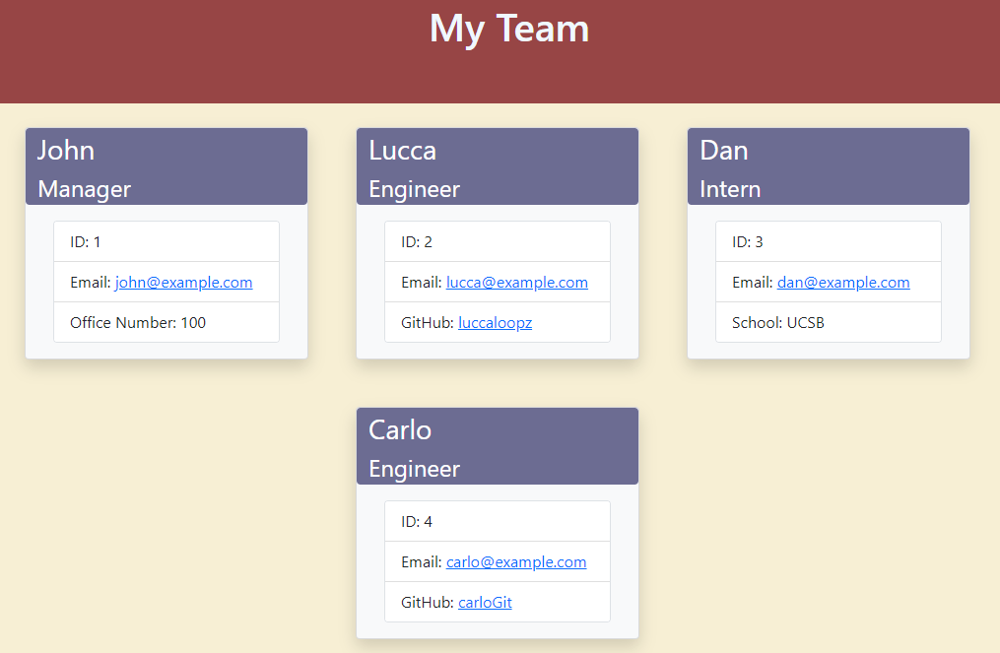

# Team Profile Generator

[](https://opensource.org/licenses/MIT)

## **Description**
The purpose of this project was to create a command-line application for developers to use that will generate an html page consisting of each team member's name, ID, email, office number (only for managers), GitHub usernames (only for engineers), and school/university (only for interns). 

## **Technologies**

* 
* 
* 
* 
* 

## **Installation**
First, you'll want to clone down this repository onto your local machine. You can do this by copying the code within the green code button towards the upper-righthand side of the screen and typing out `git clone *insert your copied code here*` within your command terminal.

Next, you'll want to type the following in the command line. This installs the dependencies that will be used. 
```
npm install
```

Lastly, you'll want to run Node to start the application. You can do this by typing the following within the command line.
```
node index.js
```

## **Usage**
The following is a link to a video walkthrough of the application: 
[](https://drive.google.com/file/d/1tl3x4yoLBbCZ5rOr5lYmCYEpPZsL1tXX/view "Video Walkthrough")

## **Application**

Below is a screenshot of what the final product looks like:




Below is a snippet of the function that generated the HTML file. This function will take the myTeam array of team member objects, loop through this array to create the various team member Bootstrap cards, and return a template literal of the final html code.

```javascript
function createTeamMemberCards(myTeam) {
    teamArray = [];

    for(let i = 0; i < myTeam.length; i++) {
        const role = myTeam[i].getRole();

        if (role === "Manager") {
            teamArray.push(generateManagerCard(myTeam[i]))
        } else if (role === "Engineer") {
            teamArray.push(generateEngineerCard(myTeam[i]))
        } else if (role === "Intern") {
            teamArray.push(generateInternCard(myTeam[i]))
        };
    };

    const memberCards = teamArray.join('');
    const generatedTeam = generatehtml(memberCards);
    return generatedTeam;
};
```

## **License**
The following application is covered under the MIT License.